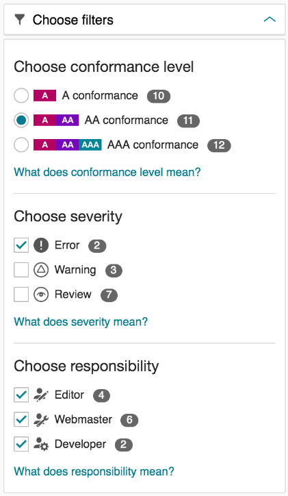

# How to run an accessibility review of a service

The following is brief guidance on carrying out an accessibility review. It's taken directly from another Government department, so some content may change. 

Once you have carried out the review, you can use the [Accessibility Review template](./template-accessibility-review.md) to generate a report. 

## Using an automated tool

1. Run the Siteimprove Chrome extension
1. Click the Siteimprove icon in the toolbar
1. Check that filters specify level AA conformance and errors only, you may have to click the refresh icon (circle with an arrow)
1. Open each main heading and click through to the issues below
1. Copy and paste the heading text. The same issue will often appear under different main headings, there is no need to copy these again, one instance of each is needed
1. Go back (arrow to the left of the issue heading) and copy and paste the next heading

Filters to choose:

## Manual testing

### Keyboard access

- Test by tabbing through the entire page. Ensure that all focus areas on the page are reached, ensure that all dropdowns and form controls work using keyboard only, compare by using a mouse to discover anything which may not work.
    - Radio buttons - only the first button will receive focus and you can tick it with either the space bar, or by moving focus using the cursor keys.
    - Use enter to test any links, use both enter and space bar to test any buttons (they should work with both).	
    - Pop up boxes should be closable using the ESC key as well as being able to press enter on an ‘X’ or ‘close’ (if there is one).

### Disable CSS

- Use the Web Developer extension and select CSS > Disable All Styles.
- Read through the content and check that it makes sense. It’s not necessarily a problem when images disappear or get bigger or previously invisible text appears as long as the content still makes sense.
    - Check the reading order. When content appears in different places than before, it should still make sense.
    - Heading structure should reflect the structure of at least the main content, like a table of contents. (You can use this Web Developer extension's feature to help with that: Information > View Document Outline.)
    - Check that headings, links and form elements still generally look like headings, links and form elements. It's fine that they look completely different than before. For example, whatever looked like a (styled) heading before disabling CSS should still look like an (unstyled) heading when CSS is disabled and be bold and bigger. And the other way around, what looks like a heading with CSS disabled, should look like a heading with CSS enabled. That is to check that the visual looks are based on meaningful semantics in the code.

### Images

Check that all alternative texts for images (“alt text”) make sense.
The Web Developer extension can help with that. To see all alt texts, select the “Images” tab and click “Replace images with alt attributes” in the extension.
- Check that the alt text in the attribute conveys the same information as the image (not necessarily a literal description).
- If the image can be considered decorative then ensure that it has no alt text (alt=”” or alt=” “). Alt text isn’t necessarily required if the information is contained within text on the page (and the sequence makes sense), unless the image is a link, in which case there must be alt text to describe the information conveyed and the destination of the link, or in the case of a decorative image it must describe the destination of the link.
- Consult W3C’s alt decision tree if in doubt.

### Page title 

- View the page source and look for the <title> element, it is always within the <head> element at the top (this page title bookmarklet makes that easier).
- Check that it conveys the information of what specific page, within what service and on GOV.UK. It needs to be in that order to be front loaded for ease of use by screenreader users.

### Page zoom (browser zoom)

Before doing this check for the first time, add a resize option to the Web Developer extension:

- Choose the “Resize” tab
- Choose “Edit Resize Dimensions...”, an option panel will open in a new tab
- Choose “+ Add...”
- Enter these details - Description: 1280x800, Width: 1280, Height: 800

Then every time you check page zoom:

- Choose the Web Developer extension’s “Resize” tab
- Choose “1280x800”
- Use CMD 0 to make sure zoom level is reset to 100%
- Use CMD + to zoom in the page to 400% (CMD + eight times will do this in Chrome and it will display the zoom level just below the URL box
- Ensure that all text on the page increases in size 
- Ensure that no layout is broken to the extent that it becomes misleading or difficult to understand (minor graphical layout issues may not be a problem)
- Ensure that no text is cut off 
- Ensure that no text now appears on a different background such that contrast between text and background is significantly reduced
- Ensure that all labels are still adjacent to form controls and form controls still make sense - i.e. instructions can’t be misinterpreted because of a change in layout
- If there are tables ensure that any changed layout makes sense and that it is possible to scroll to all rows and columns using both mouse and keyboard

## Checking the Accessibility Statement

- Check an accessibility statement exists and is linked from somewhere. It should usually be linked from the footer. But linking from the start page might also be okay.
- Check if the statement claims full compliance or not.
    - If it claims full compliance, check if issues were identified above (in the automated and manual checks).
    - If it doesn't claim full compliance, check it contains a list of issues.
- Check that it includes a contact section.
