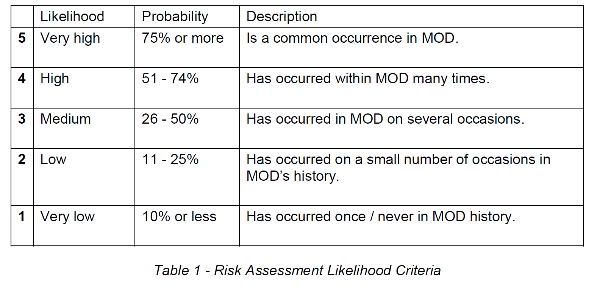
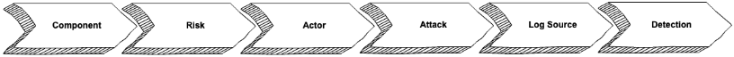

# How we manage threats and risks

Firstly, this is not about managing risks from a project management perspective. Since we're doing agile delivery, particularly GOV.UK Service Manual style, we manage risks to delivery or the product/service [appropriately](https://www.gov.uk/service-manual/agile-delivery/governance-principles-for-agile-service-delivery#:~:text=to%20be%20made-,Risk%20management,-Risks%20can%E2%80%99t%20be). 

From a security perspective, we follow a [Secure by Design](../secure-by-design/index.md) approach, which does away with traditional accreditation, and instead takes an approach to assurance and risk management that is proportionate to the risk level of the product or service. 

What this means is that not everything in, for example, JSP982 (the MoD's mandated risk management approach - an [archived version](http://data.parliament.uk/DepositedPapers/Files/DEP2015-0882/20151113-MOD_JSP_892-Risk_Management-Redacted.pdf) available online) is relevant, but inspiration and good practice can be (and has been) taken from it and other sources.

## Risk management process

Risk management (according to JSP892) as a process involves 4 steps:

1. Risk identification
2. Risk assessment
3. Risk response
4. Risk monitoring, reporting and escalation

We'll take each of these in turn, to describe the Foundry's approach. Before we do, a note on recording risks...

### Recording risk

As per JSP982, we record risks in a tabular format that covers, for each risk, its associated:

- **Consequence** (the possible effects that the risk event would have on the achievement of objectives) 
- **Event** (An incident or occurrence arising from a cause that could have consequences affecting the achievement of objectives.) 
- **Cause** (the source or driver of the risk event e.g. the underlying conditions, circumstances or activities that could lead to a risk event occurring.)
- Who is **responsible**
- **Impact** level before mitigation
- **Likelihood** before mitigation
- **Mitigation** measure put in place (An activity or measure that is expected to reduce the impact of a risk event should it occur.)
- **Control** Measure put in place (An activity or measure that is expected to reduce the likelihood of a risk event occurring.)
- **Impact** after mitigation
- **Likelihood** after mitigation
- **Residual risk**
- **Target risk** (i.e. that acceptable by the risk owner)
- Any outstanding **plan of action** required

**Likelihood**, as defined by JSP892, is based on the following criteria:

 "JSP892 likelihood table")

**Impact** definitions are sensitive so not publishable here, but ask someone in the Foundry and they can give you access, if you're an internal colleague.

### 1. Risk identification

Many of our risks in the Foundry are shared, since we re-use wherever we can. These are recorded and treated (e.g. accepted) centrally and regularly. Where there are risks that are particular to a product or service (or indeed to ascertain whether or not there are any), we generally identify these risks in a few ways:

1. by having a general discussion - i.e. allowing risks to be considered and raised on an *ad hoc* basis
2. during regular (usually fortnightly) meetings between delivery teams and their security advisor
3. at least at the beginning of a product's life - possibly at points during, too - carrying out a threat modelling exercise, as [described by the NCSC](https://www.ncsc.gov.uk/collection/building-a-security-operations-centre/onboarding-systems-and-log-sources/threat-modelling)

It looks a little something like this (read: exactly like this, as it's copied from their website):

 "threat modelling")

The outputs of this/these threat modelling session(s) will be the first few columns of the risk register/tracker, which correspond to the first few bullets in the above [recording risk](#recording-risk) section. 

### 2. Risk assessment

As per the above [Recording risk](#recording-risk) section, our assessment of risk is done using JSP892 guidelines, by the most appropriate individuals (always the team, including tech and non-tech people, preferably with a security advisor, often with the Service Owner). 

### 3. Risk response

The response to a risk clearly depends on the risk itself. **Whether or not a risk is responded to** by action is a decision that is taken by the risk owner, with support from the delivery team. 

**When** a risk is responded to by action is a priority decision, meaning that it is made by the team's Product Manager; however, if it is understood to be urgent (i.e. from the risk owner) and it prevents progress or presents an imminent threat, then it is likely that this will require immediate attention.

**How** a risk is acted upon - i.e. the controls - is decided by the appropriate person on the team. If, for example, it is a technical control, then the technical person/people on the team (usually developers) will make the decision. If it's a process thing, then probably the Delivery and/or Product Manager, etc.

### 4. Risk monitoring, reporting and escalation

Risk monitoring, reporting and escalation is done as part of the [Secure by Design](../secure-by-design/index.md) process. It describes how often things happen, between whom, and what is expected of whom for what reason (descriptive, I know). 
